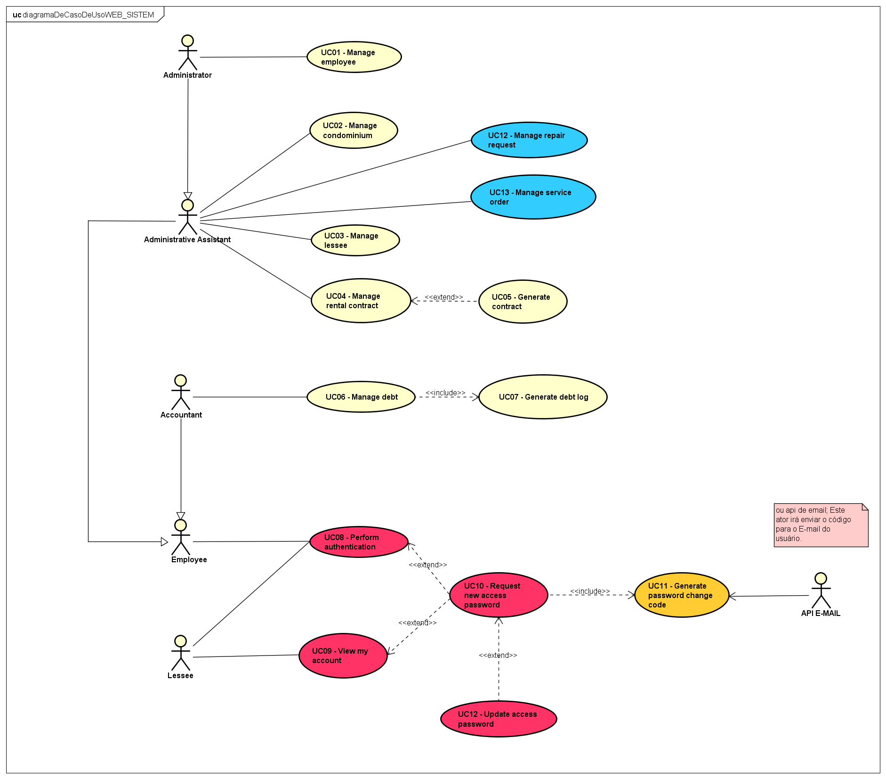

### Sistema para gerenciamento de condomínios

#### 1. Breve descrição do sistema
O sistema GC terá funcionalidades designadas para administradores, funcionários e locatários. Para a organização das atividades da empresa, o sistema será divido em um sistema web para os administradores e aplicativo mobile para funcionários de manutenção e locatários. 

Os administradores e auxiliares serão responsáveis por gerenciar os condomínios, eventuais contratos, locatários, solicitações de locatários e funcionários.

Para a descrição completa do sistema <a href="https://drive.google.com/file/d/1FiAllRxepTafrFhMbg82lyrSE0IyKUsh/view?usp=sharing" target="_blank">clique aqui</a>

Observação: A versão mobile está em desenvolvimento, portanto, as funcionalidades referentes a locatários e funcionários de manutenção serão publicadas em breve. 

#### 2. Requisitos funcionais

1.	Gerenciar funcionário
2.	Gerenciar condomínio
3.	Gerenciar locatário
4.	Gerenciar contrato de aluguel
5.	Gerar contrato
6.	Gerenciar débito
7.  Gerar log de débito
8.	Realizar login
9.	Visualizar minha conta
10.	Solicitar nova senha de acesso
11.	Gerar código de troca de senha
12.	Atualizar senha de acesso
13.	Gerenciar solicitações
14.	Gerar ordem de serviço
15.	Efetivar ordem de serviço
16.	Gerar débito
17.	Verificar histórico de pagamentos
18.	Realizar pagamento
19.	Visualizar contrato

#### 3. Acesse o sistema WEB

##### Link do sistema web e dados para autenticação
<a href="https://systemgc.netlify.app" target="_blank">Ir para o sistema WEB</a>

| Cargo | Usuário | Senha |
|-------|----------|----------|
| Administrador | 12345678910 | admin | 
| Contador | 62578672380 | eliza123 |
| Assistente administrativo | 12578678980 | amanda123 |

#### 4. Caso de uso ciclo 01
##### Abra a imagem em uma nova guia para melhor qualidade

#### 5.	Diagrama de classes a nível de análise 
##### Abra a imagem em uma nova guia para melhor qualidade

#### 6.	Desenvolvimento

1. No backend foi utilizada a linguagem de programação Java com JDK 17
2. Framework Spring Security e JWT para realizar a autenticação de usuários
3. Banco de dados Postgresql
4. JPA para acesso aos dados
5. Padrão camadas
6. Padrão DTO 
7. No frontend foi utilizado Reactjs com TypeScript 
8. Bootstrap
9. Redux 
10. SASS

#### 7.	Contato

Desenvolvedor Wisley Bruno Marques França

E-mail: srmarquesms@gmail.com

Número: 92 99107-1491 (Ligação e WhatsApp)
